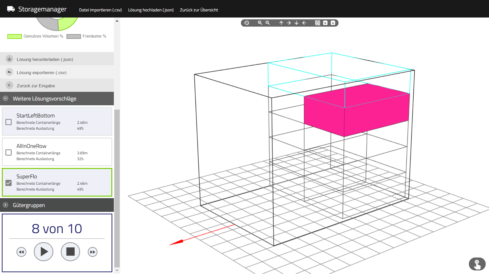

# storage-mgmr backend

The project contains a C#-backend for calculating the best combination of a given data set of orders. Click on the following link to visit the frontend on Gitub:

https://github.com/SebLeich/storage-mgmr-frontend

Live Demo (frontend only): https://sebleich.github.io/storage-mgmr-frontend/

